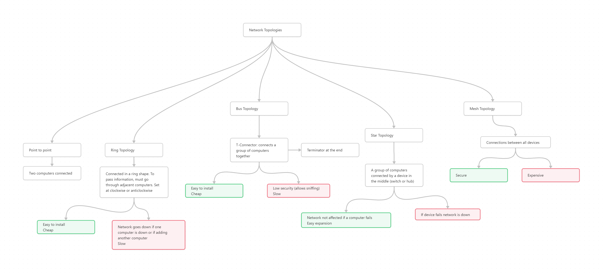
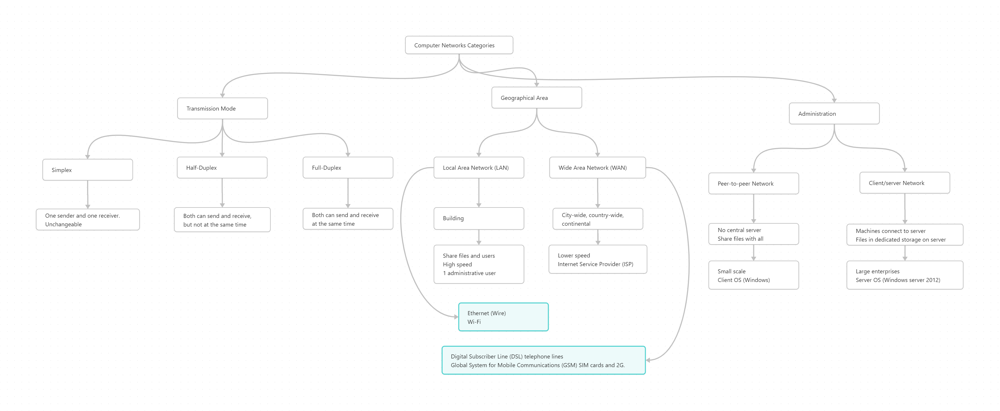
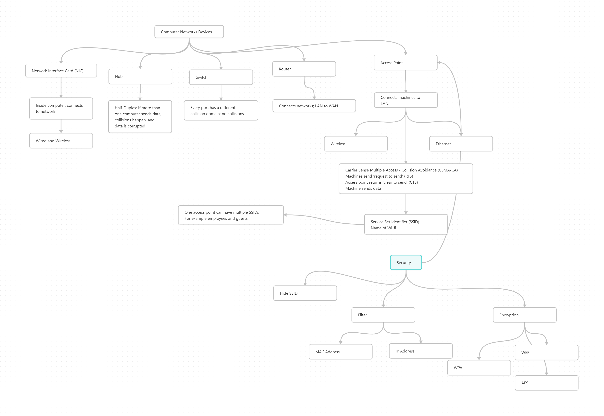
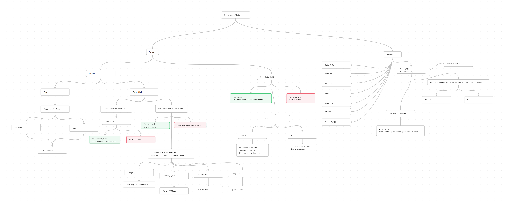
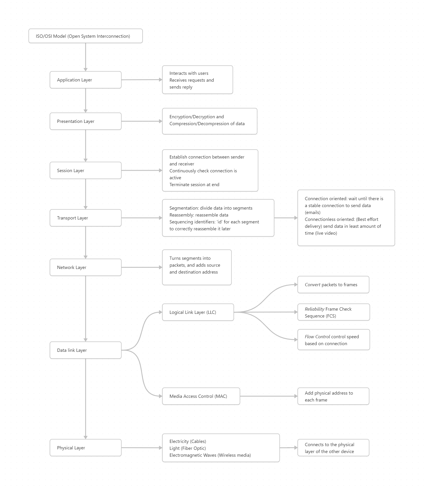
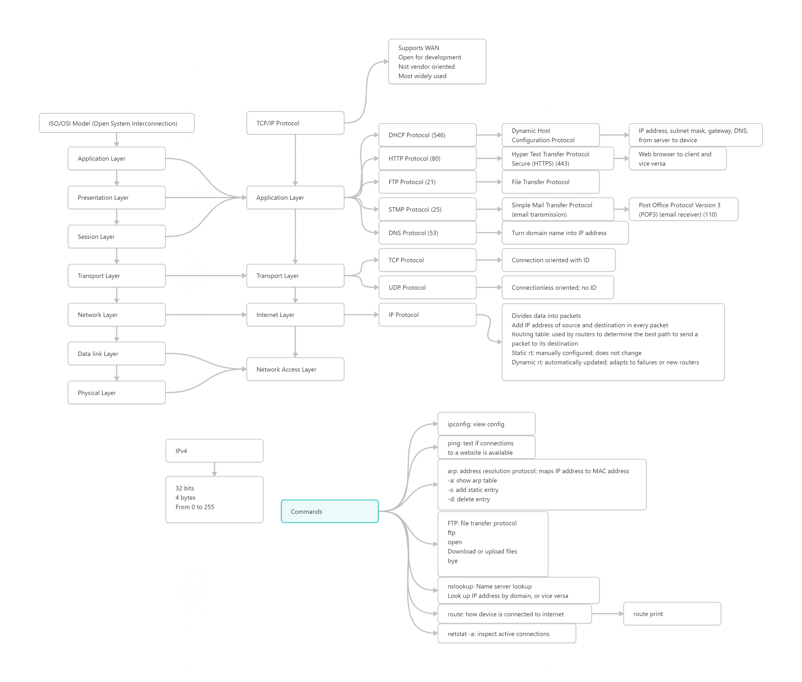

## Course: Computer Network Fundamentals
Instructor: Dr. Mohamed Adly
This course covers:
1. Define computer network and its component.
2. List Networking Devices and Hardware Types.
3. Differentiate between computer networks topologies from their shapes, features and disadvantages of each topology.
4. Compare between network categories according to transmission mode, geographical area and administration types.
5. Identify characteristics of OSI model and TCP/IP.
6. Explain the function of each layer of the OSI model and TCP/IP protocols.

Network Topologies: 
Networks Categories: 
Computer Networks Devices: 
Transmission Media (Wired & Wireless): 
ISO/OSI Model: 
TCP/IP Protocol: 